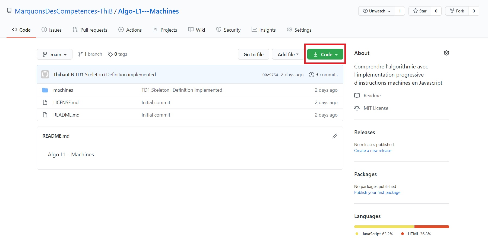
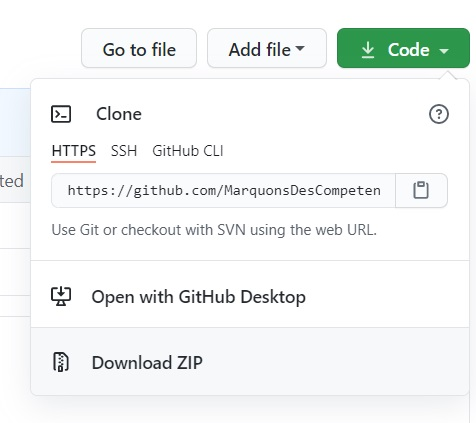

# Algo L1 - Machines
Pour vous accompagner dans votre travail personnel, voici un guide pour exécuter, observer et implémenter les machines faites théoriquement en TD ; cela avec des formulations très proches du pseudo-code utilisé. 
Bon dev' !

# Où sommes-nous ?
Sur un dépôt de fichiers (repository en anglais).

## Pourquoi ?
Découvrir l'algorithmie fonctionnelle par l'implémentation progressive d'instructions de machines déterministes.

## Comment ?
1. Téléchargez les fichiers (donc les codes) présents sur le dépôt.

### Solution 1 : conseillée
Des fichiers vont être ajoutés, d'autres modifiés... cette solution vous permettra de :
- savoir, via le logiciel, si vos fichiers sont à jour
- fusionner les modifications faites sur le dépôt avec celles que vous avez faites sur votre ordinateur. Les premières fois où vous le tenter, créez une copie de votre dossier actuel sur l'ordinateur pour être sûr de ne pas perdre vos ajouts : clic droit -> <cite>Créer un fichier compressé (archive)</cite>

1. Télécharger [GitHub Desktop](https://desktop.github.com/)
2. L'installer et l'ouvrir une première fois
3. Cliquer sur <u>Code</u> (bouton vert) -> <u>Open with GitHub Desktop</u>

### Solution 2 (déconseillée)
Cliquer sur <u>Code</u> (bouton vert) -> <u>Download zip</u>

2. Du dossier téléchargé, ouvrez le fichier <cite title="Page principale de notre micro-site local ">machines/<a href="https://github.com/MarquonsDesCompetences-ThiB/Algo-L1---Machines/blob/main/machines/index.html ">index.html</a></cite> dans un navigateur internet (<cite>Mozilla Firefox</cite>, <cite>Google Chrome</cite>, <cite>Internet Explorer</cite>....) : Double-cliquer sur le fichier ou faire <cite title="Bouton de la souris ">clic droit</cite>-><cite>Ouvrir avec...</cite>
